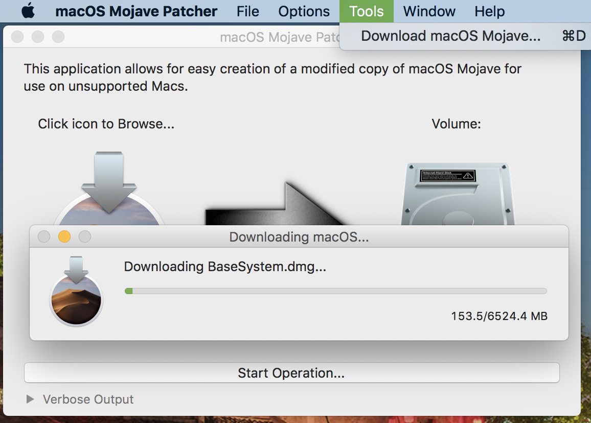
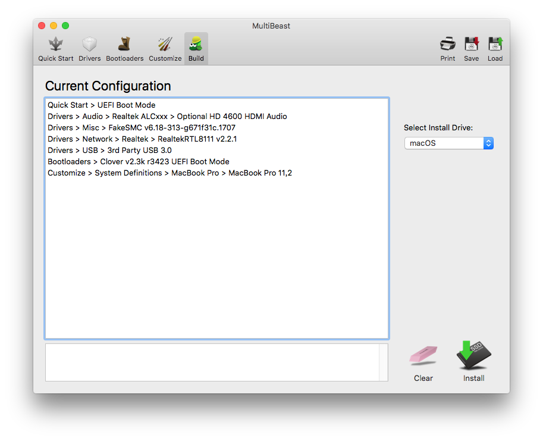
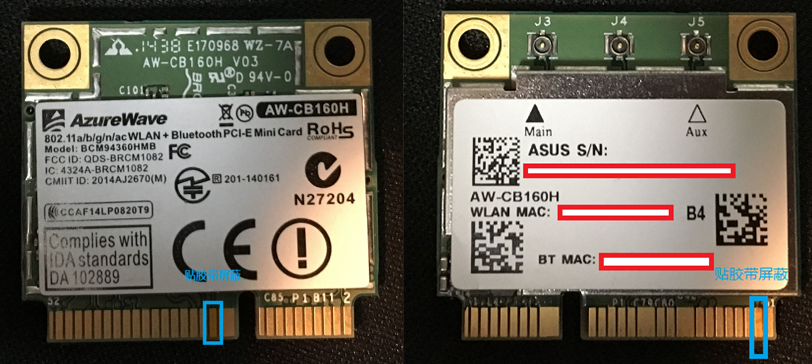

changelog:
- 2020-03-09 fix screen glitch
- 2019-12-09 替换为 WhateverGreen 驱动核显
- 2019-10-20 update to catalina

## 前期工作

必知必会.

### Windows 下挂载 Mac 的 EFI 分区

**管理员权限下执行**:

```shell
C:\Windows\system32>diskpart            // 进入 diskpart
DISKPART> list disk                     // 列出磁盘

  Disk ###  Status         Size     Free     Dyn  Gpt
  --------  -------------  -------  -------  ---  ---
  Disk 0    Online          931 GB      0 B
  Disk 1    Online          119 GB      0 B        *
  Disk 2    Online          111 GB      0 B        *

DISKPART> select disk 1                 // 选择磁盘

Disk 1 is now the selected disk.

DISKPART> list partition                // 列出所选磁盘分区

  Partition ###  Type              Size     Offset
  -------------  ----------------  -------  -------
  Partition 1    System             200 MB    20 KB
  Partition 2    Primary            118 GB   200 MB
  Partition 3    Unknown            619 MB   118 GB

DISKPART> select partition 1            // 选择分区

Partition 1 is now the selected partition.

DISKPART> assign                        // 分配盘符, 盘符为系统预设

DiskPart successfully assigned the drive letter or mount point.
```

盘符挂载好，通过自带的资源管理器

### Mac 下挂载 EFI 分区

#### 方法1，命令行方式

**1. Discover the volume identifier for your EFI boot partition.**

```shell
diskutil list
```

The output should look something like this:

```shell
/dev/disk0 (internal, physical):
   #:                       TYPE NAME                    SIZE       IDENTIFIER
   0:     FDisk_partition_scheme                        *1.0 TB     disk0
   1:               Windows_NTFS Data                    1.0 TB     disk0s1
/dev/disk1 (internal, physical):
   #:                       TYPE NAME                    SIZE       IDENTIFIER
   0:      GUID_partition_scheme                        *128.0 GB   disk1
   1:                        EFI EFI                     209.7 MB   disk1s1
   2:                  Apple_HFS macOS                   127.2 GB   disk1s2
   3:                 Apple_Boot Recovery HD             650.0 MB   disk1s3
/dev/disk2 (internal, physical):
   #:                       TYPE NAME                    SIZE       IDENTIFIER
   0:      GUID_partition_scheme                        *120.0 GB   disk2
   1:           Windows Recovery                         471.9 MB   disk2s1
   2:                        EFI NO NAME                 104.9 MB   disk2s2
   3:         Microsoft Reserved                         16.8 MB    disk2s3
   4:       Microsoft Basic Data Windows                 119.4 GB   disk2s4
```

In this case, the volume identifier of the EFI partition is `disk1s1`.

**2. Create a mount point.**

A mount point is a directory where a non-booted volume is mounted.  On Mac OS X, mount points are typically created in /Volumes.  We can create a directory called efi within /Volumes by running the following command:

```shell
mkdir /Volumes/efi
```

**3. Mount the EFI partition at the efi mount point.**

Run the command:

```shell
sudo mount -t msdos /dev/disk1s1 /Volumes/efi
```

That’s it.  Your EFI volume will be mounted.  Modify it at your own risk.

#### 方法2，GUI方式

Clover Configurator -> 工具 -> 挂载分区

## 制作系统盘

下载 Mojave 及后续版本时不像以前一样直接在 Mac App Store 下载，这时候需要使用 [`macOS Catalina Patcher`](http://dosdude1.com/catalina/) 来获得完整镜像，下载完成后使用 [`UniBeast`](https://www.tonymacx86.com/resources/unibeast-9-1-0-mojave.418/) 创建 USB 启动盘，注意启动盘格式应为 GUID。

具体格式可以通过 `diskutil list` 确认，格式化为 GUID 分区 `diskutil eraseDisk HFS+ usb GPT /dev/disk3`



## 安装系统

使用刚刚的可启动 U 盘 正常安装。

## 安装驱动

第一次开机时的状态:

- 无线网卡已经驱动好了 (目前版本 BCM94360HMB 2.4G、5G 免驱).
- 笔记本键盘和触摸板不能用, 因为没合适的 PS2 键盘驱动, 找一个 USB 外接键盘以继续.

### 安装 FakeSMC 和 Clover

第一次开机运行 MultiBeast, 它可以安装 Clover 引导和一些驱动.



安装 MultiBeast 提供的:

- FakeSMC

- Clover UEFI

安装重启, 现在可以把系统的默认启动项改为 Clover, 可以引导 Windows 和 macOS, 推荐两个系统共用一个 EFI 分区, 系统 U 盘可以暂时扔掉.

> 目前更流行使用 VirtualSMC 来代替FakeSMC，但我自己试过多次 VirtualSMC 和 Lilu 不能共存。。原因不明

### 键盘和触摸板

键盘还不能使用, 为了方便折腾, 先驱动键盘和触摸板.

这里使用的是 [OSXLatitude Forum](http://forum.osxlatitude.com/) 大神 Crew 的 [ELAN, FocalTech and Synaptics (Smart Touchpad) Driver (Mac OS X)](http://forum.osxlatitude.com/index.php?/topic/1948-elan-focaltech-and-synaptics-smart-touchpad-driver-mac-os-x/).

*Alt 键会被当成 Command 键, 外接键盘上则没这个问题.*

下载 `SmartTouchPad_v4.6.5.zip`, 打开 `Contents／PlugIns／ApplePS2Keyboard.kext/Contents/Info.plist`, 将 `Swap alt and windows key` 置 为 `false`


<key>Swap command and option</key>
          <false/>

### 显卡

Intel HD Graphics 4600

> 参照 [WhateverGreen 驱动 Intel 核显](https://zuiyu1818.cn/posts/Hac_Intel_Graphics.html)

### 修复开机花屏(boot second stage glitch)
试了很多办法都不奏效，只能修改clover分辨率为`1024*768`

### 修复开机后应用花屏(app glitch)
加入补丁
```xml
<dict>
  <key>Comment</key>
  <string>1536MB - 2048MB for HD4200_4400_4600 Mobile</string>
  <key>Disabled</key>
  <false/>
  <key>Find</key>
  <data>AQMDAwAAAAIAADABAABgAAAAAGA=</data>
  <key>InfoPlistPatch</key>
  <false/>
  <key>Name</key>
  <string>AppleIntelFramebufferAzul</string>
  <key>Replace</key>
  <data>AQMDAwAAAAIAADABAACQAAAAAIA=</data>
</dict>
```

#### TODO:

- [ ] 亮度调节，[WhateverGreen 官方教程不生效](https://github.com/acidanthera/WhateverGreen/blob/master/Manual/FAQ.IntelHD.cn.md#%E8%B0%83%E8%8A%82%E7%AC%94%E8%AE%B0%E6%9C%AC%E4%BA%AE%E5%BA%A6)

### 声卡

这台笔记本声卡型号是 VIA VT1802P

10.15.2 开始已经可以使用 AppleALC 仿冒了，仅需要加载kext即可。升级10.15.2的惊喜，之前费了好大劲搞这个。

*目前存在问题，开机默认耳机插口，需要手动切换到扬声器，麦克风测试是能用的，但杂音太大了基本不可用*

#### TODO:

- [ ] AppleALC 仿冒
- [ ] 开机自动调整音频到扬声器

### 电池

RehabMan 大神的 [OS-X-ACPI-Battery-Driver](https://github.com/RehabMan/OS-X-ACPI-Battery-Driver)

### BCM94360HMB

#### 屏蔽针脚



#### 蓝牙驱动

使用 `BrcmBluetoothInjector.kext`

#### 显示蓝牙为第三方驱动的解决办法

`FakePCIID_BCM94352Z_as_BCM94360CS2.kext`

## Clover

### Clover 启动菜单

删除 Clover 中无用的启动项.

```xml
<key>Scan</key>
<dict>
    <key>Entries</key>
    <true/>
    <key>Legacy</key>
    <false/>
    <key>Tool</key>
    <true/>
</dict>
```

## 与 Windows 共存

### 数据盘格式

因macOS使用iCloud相册必须使用HFS或AFS，只能放弃NTFS，Windows下使用 [HFS+ for Windows  by Paragon Software](https://www.paragon-software.com/us/home/hfs-windows/) 访问数据。Win下使用目前没遇到什么问题。
