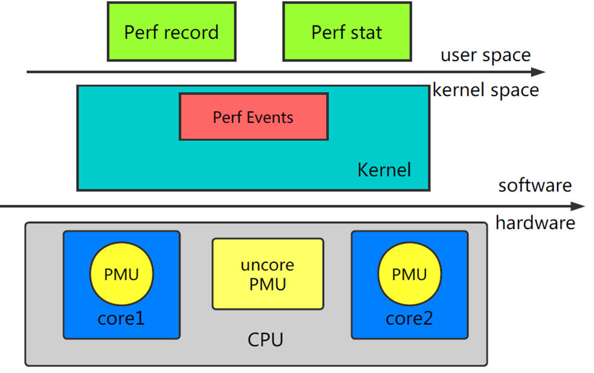

## Linux 性能分析

### 系统级别


#### 一些命令

- `uptime`: 查看cpu负载
- `top (htop)`: 进程的资源占用状况
- `ps`: 显示进程(process) 的状态
- `vmstat (free)`: 内存整体使用情况
- `iostat`: 磁盘的一些指标
- `mpstat`: 显示每个 CPU 核心的工作情况
- `ping`: 连通性和延迟
- `nicstat`: 网卡的一些指标
- `dstat`: 综合cpu, memory, IO, network, 实时展示当前的系统资源利用情况

高级一些的命令 `sar`, `netstat`, `pidstat`, `strace`, `tcpdump`, `blktrace`, `iotop`, `slabtop`, `sysctl`, `/proc`

#### 快速查看整体状态

```
1.  uptime             --> load averages
2.  dmesg | tail       --> kernel errors
3.  vmstat 1           --> overall stats by time
4.  mpstat -P ALL 1    --> CPU balance
5.  pidstat 1          --> process usage
6.  iostat -xz 1       --> disk I/O
7.  free -m            --> memory usage
8.  sar -n DEV 1       --> network I/O
9.  sar -n TCP,ETCP 1  --> TCP stats
10. top                --> check overview
```

检查每一项的`使用率`、`饱和程度`、`错误信息`

大致定位可疑的:
- **Who**: which PIDs, programs, users 
- **Why**: code paths, context 
- **What**: CPU instructions, cycles 
- **How**: changing over time 

### 函数, 指令级别

#### Linux Perf

Linux Perf – 内置的性能分析工具



**Linux Perf 架构**
- `Perf Tools`: 用户态的 Perf Tools 为用户提供了一系列丰富的工具集用于收集、分析性能数据。
- `Perf Event Subsystem`: Perf Event 子系统是内核众多子系统中的一员，其主要功能是和 Perf Tool 共同完成数据采集的工作。

**Perf 工作模式**
- `Counting Mode`: 精确统计一段时间内 CPU 相关硬件计数器数值的变化。为了统计用户感兴趣的事件，Perf Tool 将设置性能控制相关的寄存器。这些寄存器的值将在监控周期结束后被读出。典型工具：Perf Stat
- `Sampling Mode`: 以定期采样方式获取性能数据。PMU(Performance Monitor Unit)计数器将为某些特定事件配置溢出周期。当计数器溢出时，相关数据，如 IP、通用寄存器、EFLAG 将会被捕捉到。典型工具： Perf Record

>⚠️
对于Sampling Mode，如果某个进程运气特别好，每次都刚好躲过发起探测的位置，统计结果可能就完全是错的了。这是所有采样统计都有可能遇到的问题。可以对程序增压或增加采样频率。

> Performance Monitor Unit，性能监视单元，其实CPU提供的一个单元，属于硬件的范畴。通过访问相关的寄存器能读取到CPU的一些性能数据，目前大部分CPU都会提供相应的PMU

**Perf 使用**

- `perf list`:   显示perf 中能够触发采样的事件
- `perf top`:    整体分析或没有调优目标时使用
- `perf stat`:   统计程序运行时各种事件的情况
- `perf record`: 记录单个命令或进程的函数级别的统计信息
- `perf report`: 显示统计结果

> top和report需要通过记录的buildid访问本地的符号表，pid和进程的对应关系等信息来生成报告，对于通过软件包安装的程序，通常都会有dubug package(-dbgsym)即带有符号表信息的程序，如果是源码安装的就需要编译时开启debug选项。

#### Flame graph

*(perf 也提供了内置的可视化分析工具 perf timechart)*

常用的火焰图包括以下 5 种：
- CPU
- Memory
- Off-CPU
- Hot/Cold
- Differential

CPU 火焰图反映了一段时间内用户程序在 CPU 上运行的热点，其绘制原理是对 Perf 采集到的 samples 进行解析，对函数调用栈进行归纳合并，以柱状图的形式呈现。


>1. 每个长方块代表了函数调用栈中的一个函数，即为一层堆栈的内容。
>2. Y 轴显示堆栈的深度。顶层方块表示 CPU 上正在运行的函数。下面的函数即为它的祖先。
>3. X 轴的宽度代表被采集的 sample 的数量，越宽表示采集到的越多。

**典型绘制过程**

1. 采集样本

	`perf record -F 99 -g -- sleep 60`

2. 解析样本

	`perf script > out.perf`
	`./stackcollapse-perf.pl out.perf > out.folded`

3. 绘制

	`./flamegraph.pl out.kern_folded > kernel.svg`

### 应用级别

#### gprof

gprof - GNU profiler

example:
```shell
$ g++ -pg main.cpp
$ ./a.out
$ gprof a.out
```

#### gperftools

gperftools - Google Performance Tools

example:

```shell
$ g++ -DWITHGPERFTOOLS -lprofiler -g main.cpp
$ ./a.out
$ pprof --callgrind ./a.out profile.log > profile.callgrind
$ kcachegrind profile.callgrind
```

#### go tool pprof

go tool pprof - Google Performance Tools (Go)

数据收集，提供两种方式

- 运行时方式
  ```go
  import "runtime/pprof"
  pprof.StartCPUProfile(f)
  pprof.WriteHeapProfile(f)
  ```

- 服务方式
  ```go
  import _ "net/http/pprof”
  ```
数据分析
  ```
  $ go tool pprof –http=“8080” demo.o cpu.prof
  ```


## Ref
- [[1] Brendan Gregg: Overview](http://www.brendangregg.com/overview.html)
- [[2] Perf](https://perf.wiki.kernel.org/index.php/Main_Page)

