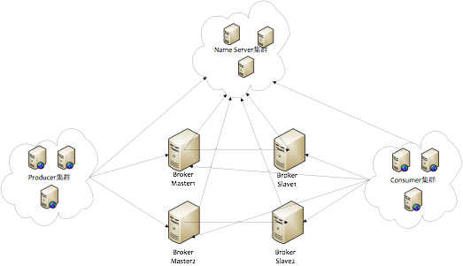
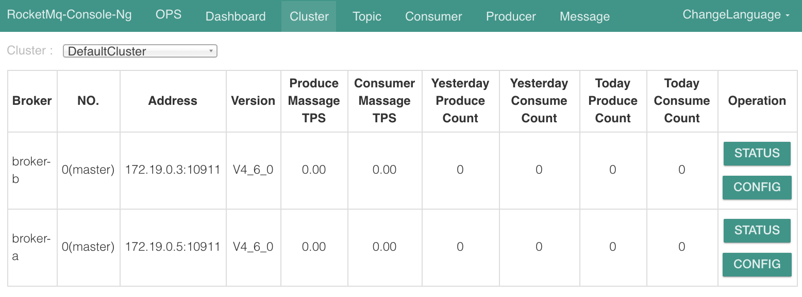
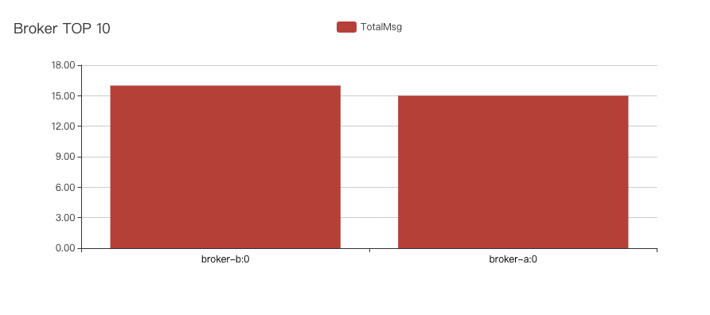

一直在使用公司提供的RocketMq环境，公司提供的是深度定制的版本。突发奇想自己也搭建一个试试。RocketMQ作为一个分布式架构的系统，docker-compose方式可以清晰的用多容器模拟分布式的状态。因为是单机器并且性能不强的情况下搭建，遇到一些坑，这里记录一下，搭建完成后使用go版本sdk进行生产消费操作

## 安装

### 1. 生成docker-compose.yml

使用官方提供的工具([RocketMQ-Docker](https://github.com/apache/rocketmq-docker.git))生成docker-compose.yml

`git clone https://github.com/apache/rocketmq-docker.git`

设置RocketMq版本，其中确保设置的`RMQ-VERSION`在[官方仓库tag](https://hub.docker.com/r/apacherocketmq/rocketmq/tags)中存在，如4.6.0

`sh stage.sh RMQ-VERSION`

执行后生成的docker-compose.yml连同配置文件放在`stages/4.6.0/docker-compose`中，可以将此文件夹拷贝出来或者直接在此文件夹运行。



生成的docker-compose包括3个服务，对应上图可以理解RocketMQ的部署结构:
- 1个无状态的`namesrv`, Name Server是一个几乎无状态节点，可集群部署，节点之间无任何信息同步。
- 2个外部挂载配置文件的`broker`, 此配置中两个都为Master无Slave

### 2. 增加可视化界面(可选)

可以将官方提供的[rocketmq-console](https://github.com/apache/rocketmq-externals/tree/master/rocketmq-console)放入docker-compose.yml中

```
rocketmq-console-ng:
  image: styletang/rocketmq-console-ng
  container_name: rocketmq-console-ng
  ports:
    - 8087:8080
  depends_on:
    - namesrv
  environment:
    - JAVA_OPTS= -Dlogging.level.root=info   -Drocketmq.namesrv.addr=namesrv:9876 
    - Dcom.rocketmq.sendMessageWithVIPChannel=false
```

### 3. 运行
`docker-compose up -d` 启动

官方有提供启动脚本 `play-docker-compose.sh`，我看了一下只是生成一些目录，没有必要使用，运行时会自动生成这些空挂载目录的

❗️可能遇到的情况
1. broker意外退出([issue 78](https://github.com/apache/rocketmq-externals/issues/78))

    原因: 可能是由于jvm内存配置原因(默认配置一个broker需要4+4=8G内存)

    解决: 减少内存使用, 对broker增加环境变量`JAVA_OPT_EXT` 值为 `-server -Xms128m -Xmx128m`

启动后打开`ip:8087`进入图形界面



### 4. 配置broker

#### 配置IP

此时cluster内可以查看启动的两个broker信息，生产消费时，客户端会连接namesvr查找broker地址，再直连broker，然而目前的broker地址是docker内部地址，需要将此地址手动设置为外部可连接的地址。

配置文件 `broker.conf` 中增加手动配置IP

`brokerIP1=10.0.0.211`

#### 配置监听端口

目前是单台机器部署两个broker，都使用同一个IP并且都使用默认端口的话，会造成端口冲突，比如上图所示目前默认状态两个broker都监听了10911端口，还需要将broker监听端口进行配置，与此同时更新docker-compose.yml里暴露的端口。

`listenPort=11911`


重新运行后，两个broker使用同一个ip监听不同端口，看起来没问题

> broker配置文档: [Broker configuration](https://rocketmq.apache.org/docs/rmq-deployment/#broker-configuration)

### 完整配置

broker-a 的配置文件 `data/conf/broker.conf`:
```
brokerClusterName = DefaultCluster
brokerName = broker-a
brokerId = 0
deleteWhen = 04
fileReservedTime = 48
brokerRole = ASYNC_MASTER
flushDiskType = ASYNC_FLUSH

brokerIP1=10.0.0.211
```

broker-b 的配置文件 `data1/conf/broker.conf`:
```
brokerClusterName = DefaultCluster
brokerName = broker-b
brokerId = 0
deleteWhen = 04
fileReservedTime = 48
brokerRole = ASYNC_MASTER
flushDiskType = ASYNC_FLUSH

brokerIP1=10.0.0.211
listenPort=11911
```

`docker-compose.yml`:
```yml
version: '2'
services:
  #Service for nameserver
  namesrv:
    image: apacherocketmq/rocketmq:4.6.0
    container_name: rmqnamesrv
    ports:
      - 9876:9876
    volumes:
      - ./data/namesrv/logs:/home/rocketmq/logs
    command: sh mqnamesrv

  #Service for broker
  broker:
    image: apacherocketmq/rocketmq:4.6.0
    container_name: rmqbroker
    links:
      - namesrv
    ports:
      - 10909:10909
      - 10911:10911
      - 10912:10912
    environment:
      - NAMESRV_ADDR=namesrv:9876
      - JAVA_OPT_EXT=-server -Xms128m -Xmx128m
    volumes:
      - ./data/broker/logs:/home/rocketmq/logs
      - ./data/broker/store:/home/rocketmq/store
      - ./data/broker/conf/broker.conf:/opt/rocketmq-4.6.0/conf/broker.conf
    command: sh mqbroker -c /opt/rocketmq-4.6.0/conf/broker.conf

  #Service for another broker -- broker1
  broker1:
    image: apacherocketmq/rocketmq:4.6.0
    container_name: rmqbroker-b
    links:
      - namesrv
    ports:
      - 11909:11909
      - 11911:11911
      - 11912:11912
    environment:
      - NAMESRV_ADDR=namesrv:9876
      - JAVA_OPT_EXT=-server -Xms128m -Xmx128m
    volumes:
      - ./data1/broker/logs:/home/rocketmq/logs
      - ./data1/broker/store:/home/rocketmq/store
      - ./data1/broker/conf/broker.conf:/opt/rocketmq-4.6.0/conf/broker.conf
    command: sh mqbroker -c /opt/rocketmq-4.6.0/conf/broker.conf

  rocketmq-console-ng:
    image: styletang/rocketmq-console-ng
    container_name: rocketmq-console-ng
    ports:
      - 8087:8080
    depends_on:
      - namesrv
    environment:
      - JAVA_OPTS= -Dlogging.level.root=info   -Drocketmq.namesrv.addr=namesrv:9876 
      - Dcom.rocketmq.sendMessageWithVIPChannel=false
```

## 使用

### rocketmq-client-go

官方已经出go原生的客户端[rocketmq-client-go](https://github.com/apache/rocketmq-client-go/tree/native)

获取库: `go get github.com/apache/rocketmq-client-go/v2`

使用库自带的examples进行测试

#### producer

向`topic: test`中发送消息

```go
func main() {
  p, _ := rocketmq.NewProducer(
    producer.WithNameServer([]string{"10.0.0.211:9876"}),
    producer.WithRetry(2),
  )
  err := p.Start()
  if err != nil {
    fmt.Printf("start producer error: %s", err.Error())
    os.Exit(1)
  }
  topic := "test"

  for i := 0; i < 10; i++ {
    msg := &primitive.Message{
      Topic: topic,
      Body:  []byte("Hello RocketMQ Go Client! " + strconv.Itoa(i)),
    }
    res, err := p.SendSync(context.Background(), msg)

    if err != nil {
      fmt.Printf("send message error: %s\n", err)
    } else {
      fmt.Printf("send message success: result=%s\n", res.String())
    }
  }
  err = p.Shutdown()
  if err != nil {
    fmt.Printf("shutdown producer error: %s", err.Error())
  }
}
```

#### consumer

消费组`testGroup`订阅`topic: test`的消息进行消费

```go
func main() {
  c, _ := rocketmq.NewPushConsumer(
    consumer.WithGroupName("testGroup"),
    consumer.WithNameServer([]string{"10.0.0.211:9876"}),
  )
  err := c.Subscribe("test", consumer.MessageSelector{}, func(ctx context.Context,
    msgs ...*primitive.MessageExt) (consumer.ConsumeResult, error) {
    for i := range msgs {
      fmt.Printf("subscribe callback: %v \n", msgs[i])
    }

    return consumer.ConsumeSuccess, nil
  })
  if err != nil {
    fmt.Println(err.Error())
  }
  // Note: start after subscribe
  err = c.Start()
  if err != nil {
    fmt.Println(err.Error())
    os.Exit(-1)
  }
  time.Sleep(time.Hour)
  err = c.Shutdown()
  if err != nil {
    fmt.Printf("shutdown Consumer error: %s", err.Error())
  }
}
```

Dashboard中查看监控，两个broker都在正常工作，符合预期，搭建完成



## Ref
[[1] 十分钟入门RocketMQ](http://jm.taobao.org/2017/01/12/rocketmq-quick-start-in-10-minutes/)