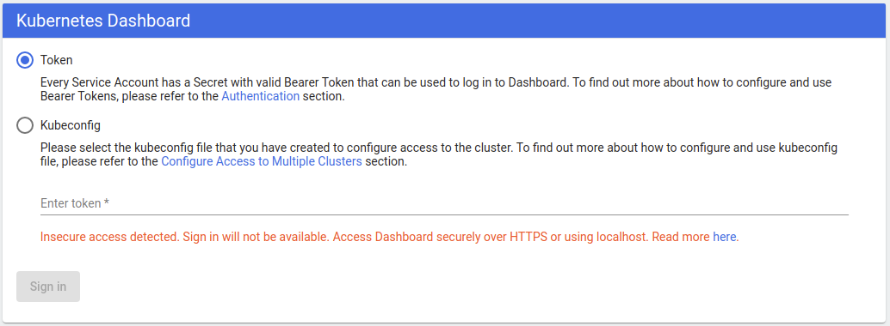
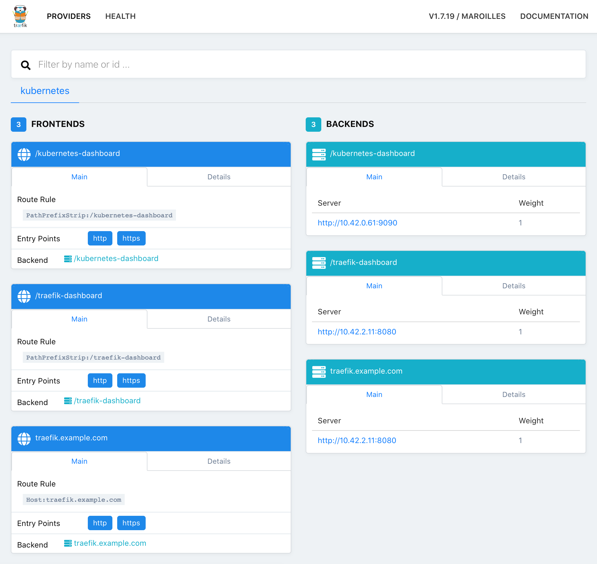

对k8s十分感兴趣，但学习k8s首先得需要个集群，单个节点没什么意思，学习或测试通常使用多个虚拟机来模拟集群。我刚好有3个树莓派，偶然发现k3s可以安装到树莓派上，k3s特别轻便，安装即用十分适合自己搭建小项目或学习。本文记录一下我搭建k3s集群的步骤，通过搭建集群的方式学习和理解k8s的基本概念和使用方法。

# 准备工作

1. 安装操作系统，我使用的是官方提供的 [Raspberry Pi OS](https://www.raspberrypi.org/downloads/)
2. 连接网络，将每台树莓派分配静态IP便于管理

# k3s 集群
K3s 官方定位为轻量级的 Kubernetes。易于安装，内存占用减半，所有功能都打包在一个不到100MB的二进制包里。

基于这些优点，搭建集群成本大大降低，十分适合部署小服务或者用来学习。我这里使用3个树莓派进行搭建，一个作为master节点，两个作为worker节点。

*如本机调试的话推荐移步使用k3d安装基于docker的集群*

使用官方安装脚本进行安装
- 安装后自动启动k3s服务
- 附带`kubectl`, `crictl`, `ctr`
-  [kubeconfig](https://kubernetes.io/docs/concepts/configuration/organize-cluster-access-kubeconfig/)  文件会写入 `/etc/rancher/k3s/k3s.yaml`，且`kubectl`会自动使用这个配置

总之就是安装后开箱即用，十分方便。

**master节点安装**

```shell
curl -sfL https://get.k3s.io | sh -
```

**worker节点安装**

```shell
curl -sfL https://get.k3s.io | K3S_URL=https://myserver:6443 K3S_TOKEN=mynodetoken sh -
```

其中参数 K3S_URL 为master节点地址， K3S_TOKEN 可以在master节点文件`/var/lib/rancher/k3s/server/node-token`中查到。

安装后使用`kubectl get nodes`查看集群节点验证是否安装成功

```shell
pi@pi0:~ $ sudo kubectl get nodes
NAME   STATUS   ROLES    AGE     VERSION
pi1    Ready    <none>   5d18h   v1.18.3+k3s1
pi2    Ready    <none>   5d18h   v1.18.3+k3s1
pi0    Ready    master   5d18h   v1.18.3+k3s1
```

一个k3s集群就搭建完成了。

# kubernetes dashboard

集群搭建后，尝试在集群运行些应用。

首先对初学者，一个炫酷的管理界面是必须要的，UI也会让人更形象的了解设计理念，k8s dashboard是特别合适的。

*k8s dashboard 的替代品还有octant*

## 安装

`kubectl apply -f https://raw.githubusercontent.com/kubernetes/dashboard/v2.0.1/aio/deploy/recommended.yaml`

使用`kubectl get pods`查看运行情况，-n 指定namespace
```shell
pi@pi0:~ $ kubectl get pods -n kubernetes-dashboard
NAME                                         READY   STATUS    RESTARTS   AGE
dashboard-metrics-scraper-6b4884c9d5-z49k9   1/1     Running   0          56s
kubernetes-dashboard-7bfbb48676-x6wgz        1/1     Running   0          56s
```

使用`kubectl get service`查看服务运行状况

```shell
pi@pi0:~ $ kubectl get service -n kubernetes-dashboard
NAME                        TYPE        CLUSTER-IP      EXTERNAL-IP   PORT(S)    AGE
kubernetes-dashboard        ClusterIP   10.43.134.232   <none>        9090/TCP   59s
dashboard-metrics-scraper   ClusterIP   10.43.90.112    <none>        8000/TCP   59s
```

## 访问

使用代理命令`kubectl proxy`访问

因为是通过局域网访问dashboard，需要设置 `--accept-hosts` 和 `--address` 参数

`kubectl proxy --accept-hosts='^*$' --address='0.0.0.0'`

访问链接 `http://pi0:8001/api/v1/namespaces/kubernetes-dashboard/services/https:kubernetes-dashboard:/proxy/`

在某个版本起，dashboard仅支持HTTPS或localhost访问



我这里提供的方法是绕开HTTPS，官方镜像是有提供HTTP方式访问端口。(注意，暴露到公网相当于暴露了所有控制权)

**暴露http端口**

Dashboard 镜像是对外提供 HTTP 接口服务的 [`dashboard/aio/Dockerfile`](https://github.com/kubernetes/dashboard/blob/master/aio/Dockerfile)，对service和deploy做如下修改：

```diff
pi@pi0:~ $ git diff recommended.yaml recommended_http.yaml
diff --git a/recommended.yaml b/recommended_http.yaml
index 8b25017..0284cfe 100644
--- a/recommended.yaml
+++ b/recommended_http.yaml
@@ -38,8 +38,8 @@ metadata:
   namespace: kubernetes-dashboard
 spec:
   ports:
-    - port: 443
-      targetPort: 8443
+    - port: 9090
+      targetPort: 9090
   selector:
     k8s-app: kubernetes-dashboard

@@ -190,10 +190,10 @@ spec:
           image: kubernetesui/dashboard:v2.0.1
           imagePullPolicy: Always
           ports:
-            - containerPort: 8443
+            - containerPort: 9090
               protocol: TCP
           args:
-            - --auto-generate-certificates
+            #- --auto-generate-certificates
             - --namespace=kubernetes-dashboard
             # Uncomment the following line to manually specify Kubernetes API server Host
             # If not specified, Dashboard will attempt to auto discover the API server and connect
@@ -207,9 +207,9 @@ spec:
               name: tmp-volume
           livenessProbe:
             httpGet:
-              scheme: HTTPS
+              scheme: HTTP
               path: /
-              port: 8443
+              port: 9090
             initialDelaySeconds: 30
             timeoutSeconds: 30
           securityContext:
```

**加权限**

界面可以免密打开了，但有权限问题

```
namespaces is forbidden:
	User "system:serviceaccount:kubernetes-dashboard:kubernetes-dashboard" cannot list resource "namespaces" in API group "" at the cluster scope

secrets is forbidden:
	User "system:serviceaccount:kubernetes-dashboard:kubernetes-dashboard" cannot list resource "secrets" in API group "" in the namespace "default"

...
```

按照提示缺少的权限逐一加上

```diff
pi@pi0:~ $ git diff recommended.yaml recommended_http.yaml
diff --git a/recommended.yaml b/recommended_http.yaml
index 8b25017..324c31b 100644
--- a/recommended.yaml
+++ b/recommended_http.yaml
@@ -38,8 +38,8 @@ metadata:
   namespace: kubernetes-dashboard
 spec:
   ports:
-    - port: 443
-      targetPort: 8443
+    - port: 9090
+      targetPort: 9090
   selector:
     k8s-app: kubernetes-dashboard

@@ -129,7 +129,28 @@ metadata:
 rules:
   # Allow Metrics Scraper to get metrics from the Metrics server
   - apiGroups: ["metrics.k8s.io"]
-    resources: ["pods", "nodes"]
+    resources: ["pods", "nodes","namespaces","secrets","persistentvolumeclaims"]
+    verbs: ["get", "list", "watch"]
+  - apiGroups: [""]
+    resources: ["persistentvolumeclaims","namespaces","persistentvolumes","nodes","secrets","configmaps","services","replicationcontrollers","events","pods"]
+    verbs: ["get", "list", "watch"]
+  - apiGroups: ["apps"]
+    resources: ["statefulsets","deployments","daemonsets","replicasets"]
+    verbs: ["get", "list", "watch"]
+  - apiGroups: ["rbac.authorization.k8s.io"]
+    resources: ["clusterroles"]
+    verbs: ["get", "list", "watch"]
+  - apiGroups: ["extensions"]
+    resources: ["ingresses"]
+    verbs: ["get", "list", "watch"]
+  - apiGroups: ["batch"]
+    resources: ["jobs","cronjobs"]
+    verbs: ["get", "list", "watch"]
+  - apiGroups: ["storage.k8s.io"]
+    resources: ["storageclasses"]
+    verbs: ["get", "list", "watch"]
+  - apiGroups: ["apiextensions.k8s.io"]
+    resources: ["customresourcedefinitions"]
     verbs: ["get", "list", "watch"]

 ---
@@ -190,10 +211,10 @@ spec:
           image: kubernetesui/dashboard:v2.0.1
           imagePullPolicy: Always
           ports:
-            - containerPort: 8443
+            - containerPort: 9090
               protocol: TCP
           args:
-            - --auto-generate-certificates
+            #- --auto-generate-certificates
             - --namespace=kubernetes-dashboard
             # Uncomment the following line to manually specify Kubernetes API server Host
             # If not specified, Dashboard will attempt to auto discover the API server and connect
@@ -207,9 +228,9 @@ spec:
               name: tmp-volume
           livenessProbe:
             httpGet:
-              scheme: HTTPS
+              scheme: HTTP
               path: /
-              port: 8443
+              port: 9090
             initialDelaySeconds: 30
             timeoutSeconds: 30
           securityContext:
```

# Ingress

上一步通过`kubectl proxy`验证功能后，我们将使用Ingress对外暴露Service，使用ingress功能前，先了解一下k3s自带的 ingress-controller。

K3s自带的 ingress-controller 是 traefik，其他选择还有 nginx ingress controller

## Traefik

traefik是有官方[Traefik Dashboard](https://docs.traefik.io/operations/dashboard/)的，开启这个炫酷的UI

1. 方法1 (命令直接编辑 traefik  的 configmap)
   `kubectl -n kube-system edit configmap traefik` 

   添加

   ```
   [api]
       dashboard = true
   ```

2. 方法2 (命令式对象配置)
   修改`/var/lib/rancher/k3s/server/manifests/traefik.yaml`

   valuesContent 中添加，`kubectl apply -f` 生效

   ```
   dashboard:
     enabled: true
   ```

临时使用端口转发验证ui是否开启成功

`kubectl --address 0.0.0.0 -n kube-system port-forward deployment/traefik 8080`

访问
`http://pi0:8080`



## Ingress 配置

需要注意的是 ingress-controller 是 traefik，所以不要错使用了 nginx 的配置

**traefik-dashboard-ingress**

```yaml
metadata:
  annotations:
    traefik.ingress.kubernetes.io/rule-type: PathPrefixStrip

spec
  - http:
      paths:
      - backend:
          serviceName: traefik-dashboard
          servicePort: dashboard-http
        path: /traefik-dashboard
```

使用`http://pi0/traefik-dashboard`访问

**kubernetes-dashboard-ingress**

```yaml
metadata:
  annotations:
    traefik.ingress.kubernetes.io/rule-type: PathPrefixStrip

spec
  - http:
      paths:
      - backend:
          serviceName: kubernetes-dashboard
          servicePort: 9090
        path: /kubernetes-dashboard
```

使用`http://pi0/kubernetes-dashboard`访问


# 结论

在了解k8s基本概念后再在实体机上搭建一套环境，部署和调试了周边工具。这一趟下来k8s的基本使用上没问题了，掌握了一个新技术后为自己打开一个新的大门