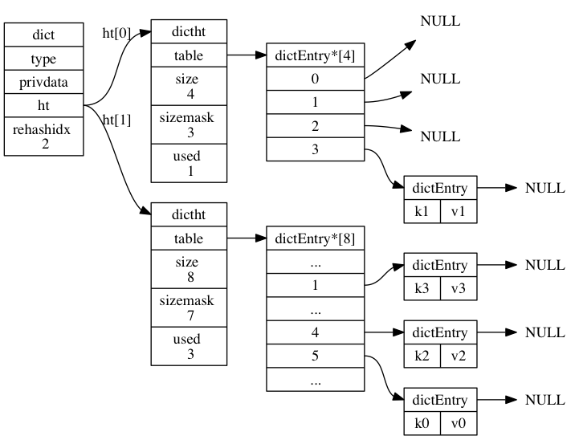

## 数据结构和对象

数据结构 | 源码位置
--- | ---
SDS | sds.h
LinkList | adlist.h
Dict | dict.h

### Simple Dynamic Strings

**文档**: [Hacking Strings](https://redis.io/topics/internals-sds)

[`sds.h`](https://github.com/redis/redis/blob/156599ba2db1706cd5ce10f1c335f36c3ccb94ea/src/sds.h#L51)
```c
typedef char *sds;

struct __attribute__ ((__packed__)) sdshdr8 {
    uint8_t len;         // 字符串长度
    uint8_t alloc;       // 字符串最大容量
    unsigned char flags; /* 3 lsb of type, 5 unused bits */
    char buf[];
};
```
- sds 是指向一个 C 字符串的指针, 访问 Header 需要向前寻址
- `struct __attribute__ ((__packed__))` 表示不要内存对齐, 使用紧凑模式
- `char buf[]` 是柔性数组, 在结构体的最后, 此前需要至少一个成员, 其大小不计入结构体
- 不同长度字符串可以使用不同大小的 Header 从而节省内存, 如 sdshdr8 使用 uint8_t 表示长度.
- `flag` 前 3 个 bit 表示类型, 后 5 bit 未用. Header 与 buf 内存连续, flags 字段可以使用 sds[-1] 访问. 如
[sds.h](https://github.com/redis/redis/blob/156599ba2db1706cd5ce10f1c335f36c3ccb94ea/src/sds.h#L87)

    ```c
    static inline size_t sdslen(const sds s) {
        unsigned char flags = s[-1];
        switch(flags&SDS_TYPE_MASK) {
            case SDS_TYPE_5:
                return SDS_TYPE_5_LEN(flags);
            case SDS_TYPE_8:
                return SDS_HDR(8,s)->len;
            case SDS_TYPE_16:
                return SDS_HDR(16,s)->len;
            case SDS_TYPE_32:
                return SDS_HDR(32,s)->len;
            case SDS_TYPE_64:
                return SDS_HDR(64,s)->len;
        }
        return 0;
    }
    ```

**结论**

与原生 C 字符串相比:
1. 保存了长度
2. API 安全, 不会造成缓冲区溢出
3. 修改字符串长度 N 次最多执行 N 次内存分配 (C 字符串一定为 N 次)
4. 二进制安全, 可以保存二进制数据 (C字符串会用`\0`分割)
5. 可以复用一部分<string.h>库函数


### LinkList

[`adlist.h`](https://github.com/redis/redis/blob/156599ba2db1706cd5ce10f1c335f36c3ccb94ea/src/adlist.h#L36)

```c
typedef struct listNode {
    struct listNode *prev;
    struct listNode *next;
    void *value;
} listNode;

typedef struct listIter {
    listNode *next;
    int direction;
} listIter;

typedef struct list {
    listNode *head;
    listNode *tail;
    void *(*dup)(void *ptr);
    void (*free)(void *ptr);
    int (*match)(void *ptr, void *key);
    unsigned long len;
} list;
```

实现为双端链表

### Dict

```c
typedef struct dictEntry {
    void *key;  // 值可以为指针
    union {
        void *val;
        uint64_t u64;
        int64_t s64;
        double d;
    } v;
    struct dictEntry *next;  // 使用链地址法解决冲突, 新节点会添加到表头
} dictEntry;

/* This is our hash table structure. Every dictionary has two of this as we
 * implement incremental rehashing, for the old to the new table. */
typedef struct dictht {
    dictEntry **table;
    unsigned long size;
    unsigned long sizemask;  // mask for calc hash, always equal size-1, 使用hash值和mask计算索引index = hash & dict->ht[x].sizemask;
    unsigned long used;
} dictht;

typedef struct dict {
    dictType *type;  // hashFunction(key)定义在此(dict->type->hashFunction(key))
    void *privdata;
    dictht ht[2];  // ht[1]只会用于rehash
    long rehashidx; // 当前rehash进度，-1为未在rehash
    int16_t pauserehash; /* If >0 rehashing is paused (<0 indicates coding error) */
} dict;
```



**hash方法**

当字典被用作数据库的底层实现, 或者哈希键的底层实现时, Redis 使用 MurmurHash2 算法来计算键的哈希值.

> MurmurHash算法最初由Austin Appleby于2008年发明, 这种算法的优点在于, 即使输入的键是有规律的, 算法仍能给出一个很好的随机分布性, 并且算法的计算速度也非常快.

**rehash**

负载因子 (load factor) 要维持合理的范围内

`load_factor = ht[0].used / ht[0].size`

**扩展条件**:

- 未执行 BGSAVE 或 BGREWRITEAOF 命令, 且 load_factor >= 1
- 正执行 BGSAVE 或 BGREWRITEAOF 命令, 且 load_factor >= 5

扩展为: 第一个大于等于 `ht[0].used*2` 的 `2^n`

> 在执行 BGSAVE 命令或 BGREWRITEAOF 命令的过程中, Redis 需要创建当前服务器进程的子进程, 而大多数操作系统都采用写时复制 (copy-on-write) 技术来优化子进程的使用效率, 所以在子进程存在期间, 服务器会提高执行扩展操作所需的负载因子, 从而尽可能地避免在子进程存在期间进行哈希表扩展操作, 这可以避免不必要的内存写入操作, 最大限度地节约内存.

**收缩条件**:

- `load_factor < 0.1`

收缩为: 第一个大于等于 `ht[0].used` 的 `2^n`

**渐进式**

避免对服务器性能造成影响, rehash 为多次, 渐进式完成的

1. 为 ht[1] 分配空间, 让字典同时持有 ht[0] ht[1]
2. 将数据从 ht[0] rehash 到 ht[1], rehashidx 记录进度, 完成时置为-1

**rehash期间**

- delete/find/update 操作时字典会同时使用 ht[0] 和 ht[1] 两个哈希表
- insert操作只会使用 ht[1] 表, 确保 ht[0] 只增不减
